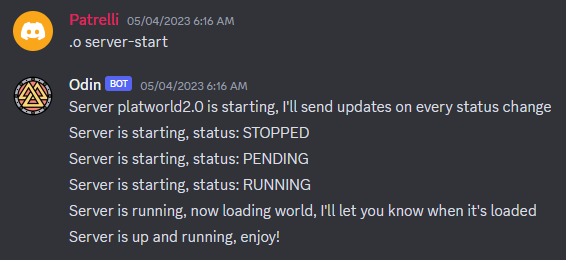
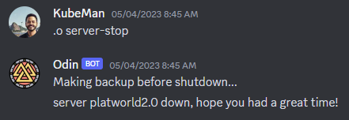
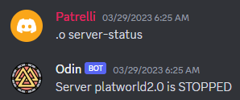
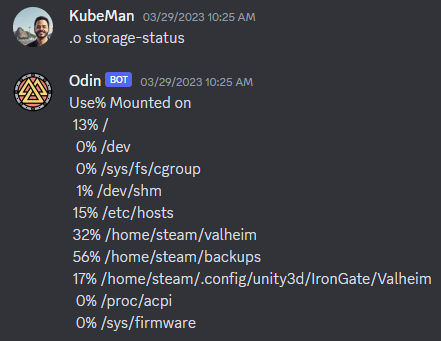

# odin-discord-bot
Discord bot to manage this [Valheim server](https://github.com/rdalbuquerque/valheim-server-asg-ec2)
- [odin-discord-bot](#odin-discord-bot)
  - [goal](#goal)
  - [commands](#commands)
  - [infra](#infra)
  - [Registering new servers](#registering-new-servers)
  - [Example usage](#example-usage)
    - [start](#start)
    - [stop](#stop)
    - [status](#status)
    - [storage debug](#storage-debug)


## goal
The goal of this Discord bot is to manage Valheim server state.

## commands
`server-start`: It goes thru the following steps: 
1. Scale up VM 
2. Scale up Valheim service 
3. Wait for the 'Game connected' on logs to report LOADED state

`server-stop`: It goes thru the following steps: 
1. Stops Valheim process 
2. Make Valheim bkp 
3. Scale down VM

`server-status`: if server is fully loaded, the status will be LOADED, otherwise, report ecs task status.

`storage-status`: It runs `df -h` inside the container, showing the usage % of every mount

## infra
The bot runs on an ECS container using Fargate spot capacity provider. The Terraform code is [here](https://github.com/rdalbuquerque/odin-discord-bot/tree/main/infra)

## Registering new servers
This bot s capable of managing one Valheim server per Discord guild.\
To add a new server, add the key and values on worlds.json in the bots s3 bucket, here is a reference:
```json
{
    "<discord_guild_1>": {
        "worldname": "<guild_1_worldname>",
        "clustername": "<guild_1_clustername>"
    },
    "<discord_guild_2>": {
        "worldname": "<guild_2_worldname>",
        "clustername": "<guild_2_clustername>"
    }
}
```
Where `worldname` will be Valheim's world name, and `clustername` will be ECS cluster name.

To provision a new Valheim server with ECS EC2 Spot capacity provider and EBS go to [this repo](https://github.com/rdalbuquerque/valheim-server-asg-ec2), or, if you prefer an ECS with Fargate and EFS, go to [this other repo](https://github.com/rdalbuquerque/valheim-server-fargate)

## Example usage
### start
> `.o server-start`
>
### stop
> `.o server-stop`
>
### status
> `.o server-status`
>
### storage debug
> `.o storage-status`
>